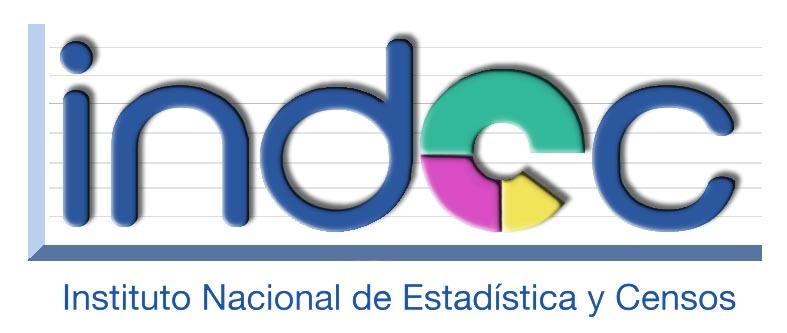

# Capacitación en Git

## ¡Bienvenidos!
### Pueden consultar la guía del curso [acá](./docs/index.md) 

## Prácticas
* [Local Remotes](./docs/LocalRemotes.rst)
* [Branches remotos](./docs/remotes-rebasing.md)
* [Consejos para commitear](./docs/CommitTips.rst)

## Descargar presentaciones en [slides](./slides)

